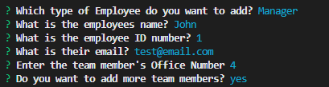

  

  # M10-Team-Profile-Generator

  ## Description
  This project generates team member profiles based on user input. During this project I learned to:
  - Use the jest npm package to create tests
  - Build tests to know what is expected from a project
  - Get classes to require other classes in order to not have redundant code.
  - Use module exports and module requires.

  ## Table of Contents
  
  1. [Installation](#installation)
  2. [Usage](#usage)
  3. [Contributing](#contributing)
  4. [Tests](#tests)
  5. [License](#license)
  6. [Questions](#questions)
  
  ## Installation
  
  1. Clone the repo to your local machine. 
  2. Make sure you have node.js installed. 
  3. Use npm i in the terminal to install the package.
  
(<a href="#readme-top">back to top</a>)

  ## Usage
  
  Open your terminal and run "npm start" in the command line.
  
(<a href="#readme-top">back to top</a>)

  
  [Screencastify Video Demo](https://drive.google.com/file/d/13lp2WQEJRzRHtmOukXh68tjEbx20n6xG/view)
  
  

  ## Contributing
  
  To contribute: 
  1. Fork the repo. 
  2. Make the changes you think would benefit this project
  3. Submit a pull request for review.
  
(<a href="#readme-top">back to top</a>)

  ## Tests
  
  In the command line, run `npm run test`.
  
  
(<a href="#readme-top">back to top</a>)

  ## License
  Copyright (c) [benjamincottrell](https://github.com/benjamincottrell). All rights reserved. 
  
Licensed under the [MIT license](https://choosealicense.com/licenses/mit/).
  
(<a href="#readme-top">back to top</a>)

  ## Questions
  For any further questions feel free to contact me via:
  - GitHub: [benjamincottrell](https://github.com/benjamincottrell)
  - Email: [bencottrell48@yahoo.com](mailto:bencottrell48@yahoo.com)
  
(<a href="#readme-top">back to top</a>)

